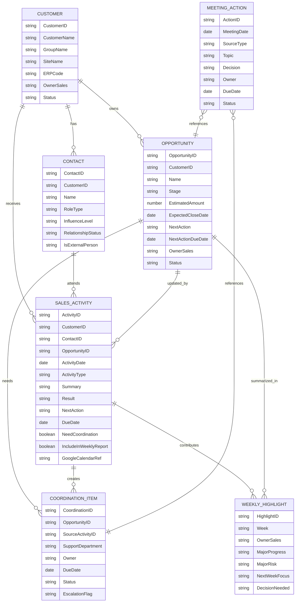
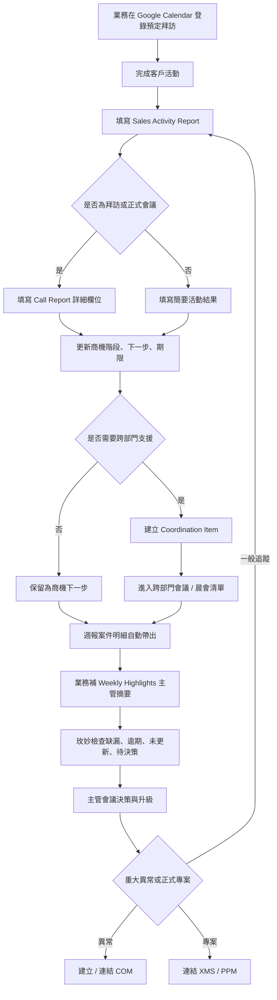

# CRM Lite 專案 MIS 分析與規劃草案

依據聊天紀錄整理。這份文件不是 Power Apps 規格，也不是把聊天內容逐字轉成需求，而是從企業資訊部角度先收斂管理問題、系統邊界、技術選型與分期策略。

## 0. 管理結論

老闆真正想解決的不是「做一套新的 CRM」，而是業務管理失控風險：

- 業務活動、商機、週報、晨會、跨部門追蹤分散在不同工具，主管看不到一致的案件狀態。
- 業務週報大量手工整理，資料重複輸入，最後變成文字報告而不是管理資料。
- 現有鼎新 CRM 有客戶、商機與 Sales Activity，但使用率、手機介面、ERP 串接與週報支援不足。
- 業務行政小主管目前的能力與工時不足以獨立主導 CRM 架構，應先讓她成為流程代表與資料品質管理者，而不是系統設計負責人。
- CRM Lite 第一期應只做一件事：讓業務活動回報成為唯一主要輸入，週報、晨會清單與跨部門追蹤由系統視圖產生。

第一期不應導入 Dynamics 365 Sales，也不應把所有功能塞進 Power Apps。應先用 SharePoint Lists + Power Apps Canvas + Power Automate 建立可用的 CRM Lite，並保留未來遷移到 Dataverse / Dynamics 365 Sales 的資料模型路徑。

## 1. 第一部分：理解需求

### 1.1 老闆真正想解決的問題

1. 建立業務管理的單一事實來源，避免鼎新 CRM、Word、Excel、LINE、XMS、Google Calendar 各自為政。
2. 降低業務週報製作負擔，讓業務不要每週手工搬資料。
3. 讓主管能看見商機狀態、下一步、逾期、跨部門卡點與待決策事項。
4. 讓業務行政小主管從「靠記憶追事情」轉為「用制度追資料品質與異常」。
5. 為未來 Dynamics 365 Sales 或更完整 CRM 打底，但不要第一期就買大系統。

### 1.2 真正需求 Business Requirement

- 客戶、廠別、聯絡人、Key Man 需有一致主檔與負責人。
- 商機需有階段、金額或量體、預計成交日、下一步、期限、負責人與停滯判斷。
- Sales Activity / Call Report 需作為業務主要輸入入口。
- 業務週報第二頁以後的案件明細應由 CRM Lite 自動產生，業務只補主管摘要。
- 跨部門協調事項需可追蹤責任人、期限、狀態與升級。
- 晨會決議需從 LINE 圖片或文字稿轉為可搜尋、可追蹤的正式紀錄。
- Google Calendar 繼續作為預定行程登錄工具，CRM Lite 記錄實際活動結果。
- XMS 的異常提報未來移交 COM，CRM Lite 只保留關聯與摘要。
- 權限、資料 Owner、必填規則、修改規則與資料保存需明確定義。

### 1.3 目前想到的解法，不應直接視為需求

- 「用 Lists + Power Platform」是候選技術，不是需求本身。
- 「Planner 連動」目前不納入第一期，因現行業務規範使用 Google Calendar。
- 「Outlook 聯絡人同步」是便利功能，不是主資料需求。
- 「GPS 打卡、AI/RPA 稽核」屬於第二期以後，且涉及隱私與人資制度。
- 「完整 Power BI Dashboard」不是第一期，需等資料口徑穩定。
- 「全部取代鼎新 CRM」不是第一期，先保留歷史並移轉日常新增。
- 「完整 Key Man 關係網」不是第一期，先建立基本聯絡人與影響角色。

### 1.4 尚未定義清楚的需求

- 商機階段定義：每一階段的進入條件、退出條件、預設成交機率。
- 客戶層級：客戶集團、公司、廠別、ERP 客戶代碼如何對應。
- Key Man 定義：外部顧問、代理商、非客戶員工如何分類與授權。
- 業務週報格式：第一頁主管摘要需要哪些固定欄位、誰審核。
- 跨部門事項與 XMS / PPM / COM 的切換條件。
- 鼎新 CRM 哪些資料品質可用、哪些只保留歷史查詢。
- Google Calendar 與 CRM Lite 是否只人工抽查，或未來自動比對。
- 資料權限：業務是否只能看自己的客戶，主管是否看全區，行政是否可改所有資料。
- KPI：第一期成功要用節省週報工時、資料完整率、使用率或主管滿意度衡量。

### 1.5 應再訪談主管的問題

1. 第一階段最想減少哪一種痛苦：週報、商機追蹤、跨部門追蹤，還是資料品質？
2. 主管每週看週報後要做哪些決策？
3. 哪些案件必須列入週報，哪些不需要？
4. 商機停滯多久算異常？
5. 哪些跨部門事項應留在 XMS，哪些應移入 CRM Lite？
6. 鼎新 CRM 未來定位是保留、停用，還是只作歷史查詢？
7. 業務不填 Sales Activity 的管理後果是什麼？
8. 是否接受第一期不做自動 Google Calendar 串接、不做 GPS、不做 Power BI？

## 2. 第二部分：MIS 系統盤點

| 系統 | 目前角色 | 重疊 / 問題 | MIS 建議 |
|---|---|---|---|
| 鼎新 CRM | 客戶、商機、Sales Activity | 無手機介面、未串 ERP、使用率下降、週報支援弱 | 保留歷史；匯出客戶與進行中商機；日常活動逐步轉到 CRM Lite |
| Google Calendar | 業務預定行程與外出登錄 | 只有計畫，沒有活動結果 | 保留為行程主工具；CRM Lite 記錄實際結果；第二期再評估自動比對 |
| Word 週報 | 業務進度週報 | 手工整理、重複輸入、不可結構化分析 | 優先淘汰為主資料；改成 CRM Lite 週報視圖或輸出文件 |
| Excel / VBA | 從 CRM 匯出再整理週報 | 容易荒廢，依賴個人維護 | 只作臨時資料清理與匯入，不作正式流程 |
| XMS | 安裝協調、客戶需求跨部門協調、異常提報 | 任務與異常混雜 | 異常交 COM；跨部門事項逐步移到 CRM Lite；大型安裝可留 XMS / PPM |
| LINE Concall | 晨會通訊與文字稿 | 即時但不可追蹤、圖片不可搜尋 | 保留通話；正式決議進 Meeting Actions |
| 月報外掛 | 進廠量統計 | 只能看全公司進廠量，貢獻度未完成 | 保留；CRM Lite 預留客戶 / 廠別 / 業務對應欄位 |
| SharePoint Lists | 候選 CRM Lite 資料層 | 大量資料、複雜權限與關聯會受限制 | 適合第一期輕量主資料與活動紀錄 |
| Power Apps Canvas | 候選操作介面 | 維護需 MIS 能力，複雜商業邏輯不宜過度堆疊 | 做手機可用的 Sales Activity 入口與管理視圖 |
| Power Automate | 提醒、週報視圖、資料流 | 過度自動化會難維護 | 第一階段只做必要提醒與狀態更新 |
| Planner | 客服預約與內部公告 | 業務已用 Google Calendar，不宜雙軌 | 不納入 CRM Lite 第一期 |
| Outlook | 郵件與聯絡人副本 | 個人聯絡人不應成為 CRM 主資料 | 可作通知與便利副本，不作主資料 |
| Power BI | 管理分析 | 資料口徑未穩定前報表無效 | 第三階段導入 |
| Dataverse | 企業級資料平台 | 需 premium 授權與治理 | 第二階段或資料量、權限、關聯變複雜時導入 |
| Dynamics 365 Sales | 標準 CRM 套裝 | 成本、導入與流程成熟度要求較高 | 第三階段評估，不作第一期起點 |

## 3. 第三部分：Technology Selection

### 3.1 為什麼第一期不用 Planner

Planner 是任務管理，不是行程主檔，也不是 CRM 主資料。聊天紀錄已確認業務規範是 Google Calendar 登錄行程，Planner 目前在客服部門使用。若第一期強行加入 Planner，會造成三套紀錄：Calendar 計畫、CRM 活動、Planner 任務。這會增加使用者負擔。

建議：Planner 不納入第一期。未來若要做個人任務，可讓 CRM Lite 的 Follow-up Item 作為管理主資料，再選擇性建立 Planner Task。

### 3.2 Google Calendar 不被取代時的做法

第一期分工：

- Google Calendar：預定去哪裡、何時拜訪、行程是否登錄。
- CRM Lite Sales Activity：實際做了什麼、見了誰、結果、下一步、是否影響商機。
- 行政抽查：先人工比對 Calendar 與 Sales Activity。
- 第二期：若管理價值明確，再用 Power Automate Google Calendar connector 做自動比對。

Microsoft 的 Google Calendar connector 可建立、取得、列出、更新、刪除事件，代表技術上可整合，但第一期不應因技術可行就導入。

### 3.3 平台選型

| 技術 | 適合交付 | 優點 | 限制 / 成本 | 建議 |
|---|---|---|---|---|
| SharePoint Lists | Customers、Opportunities、Sales Activities、Coordination Items | 成本低、M365 內建、上手快 | 大量資料與複雜查詢需注意清單檢視門檻；複雜權限難維護 | 第一期主資料層 |
| Power Apps Canvas | 業務手機輸入、主管/玫妙視圖 | 行動端友善、可快速做表單 | 複雜邏輯容易變難維護；SharePoint delegation 要設計好 | 第一期操作層 |
| Power Automate | 建立週報候選資料、提醒、狀態更新 | 快速串接 M365 與外部工具 | 流程太多會難監控；跨系統錯誤需補償機制 | 只做高價值自動化 |
| Power BI | Pipeline、停滯、轉換率、資料完整率 | 管理分析強 | 前提是資料定義穩定 | 第三期 |
| Dataverse | 複雜關聯、權限、商業規則 | 資料模型、角色權限、商業規則強，且 Dynamics 365 也使用 Dataverse | 通常涉及 premium 授權與治理成本 | 第二期評估升級 |
| Model-driven App | 標準化 CRM 後台 | 快速產生表單、檢視、流程 | 使用者體驗較制式，初期外勤輸入不一定友善 | 若升 Dataverse，可作主管/後台 |
| Dynamics 365 Sales | 完整 CRM | 標準帳戶、聯絡人、Lead、Opportunity、Forecast、Pipeline、行動 App | 成本高，流程成熟度要求高，導入需變革管理 | 第三期或多部門成熟後 |

Microsoft 文件重點：Dataverse 提供表格、關聯、角色安全、商業規則與 Dynamics 365 共用資料平台；Dynamics 365 Sales 本身跑在 Dataverse 並使用 model-driven app；Power Apps for Microsoft 365 可連 Microsoft 365 資料，但 premium / custom connector 與正式 Dataverse 生產環境需額外授權評估。

## 4. 第四部分：專案策略

### Phase 1：CRM Lite 最小可行管理制度

目標：

- 取代手工週報案件明細。
- 讓 Sales Activity Report 成為業務主要輸入。
- 建立 Customers、Opportunities、Sales Activities、Weekly Highlights 四個核心資料區。

交付成果：

- 第一版欄位定義、必填規則、資料 Owner。
- Power Apps 手機輸入表單。
- 週報視圖：案件明細自動帶出，業務只補主管摘要。
- 基本逾期 / 缺漏清單。

風險：

- 業務不填或填得太簡略。
- 欄位太多導致使用率低。
- 主管仍要求 Word 舊格式，造成雙軌。

成功條件：

- 業務每次活動後能在 3 到 5 分鐘內完成回報。
- 第二頁以後週報不再手工重打。
- 每週能看出未更新、逾期、待決策事項。

### Phase 2：會議與跨部門追蹤整合

目標：

- 將 XMS 中屬於客戶需求 / 安裝協調的追蹤逐步移入 CRM Lite。
- 將 LINE 晨會正式決議改為 Meeting Actions。
- 建立 Google Calendar 人工抽查或半自動比對。

交付成果：

- Coordination Items。
- Meeting Actions。
- 跨部門會議視圖。
- COM / XMS / PPM 連結規則。

風險：

- CRM Lite 被誤用成所有任務系統。
- XMS、COM、PPM 邊界不清。
- 會議紀錄變成逐字稿，而不是決議追蹤。

成功條件：

- 晨會後只追「決議、負責人、期限、狀態」。
- 跨部門逾期事項可被主管看見。
- COM 異常不在 CRM Lite 重做閉環。

### Phase 3：管理分析與平台升級

目標：

- 導入 Power BI / Dataverse / Dynamics 365 Sales 評估。
- 建立 Pipeline、報價轉換、客戶營收、Key Man 覆蓋、活動有效性分析。

交付成果：

- Power BI 管理儀表板。
- Dataverse 可行性評估。
- Dynamics 365 Sales 遷移評估與 ROI。
- 與 ERP / 月報資料映射。

風險：

- 資料口徑未穩定就做 BI，產出漂亮但不可信的報表。
- 過早買 Dynamics 365，最後仍回到手工週報。
- 客製太多，未來遷移成本升高。

成功條件：

- 連續 2 至 3 個月資料完整率穩定。
- 主管會議真的使用系統視圖決策。
- 可明確判斷是否需要 Dynamics 365 Sales。

## 5. 第五部分：Build vs Buy

### 值得自己開發

- Sales Activity Report / Call Report 輕量輸入。
- 週報視圖與主管摘要。
- Coordination Items 與 Meeting Actions。
- 現有 Google Calendar、XMS、LINE、鼎新 CRM 的過渡整合。
- 資料品質檢查清單。

理由：這些高度依賴公司現況、流程轉型與使用習慣，套裝 CRM 未必能低成本解決。

### 應使用 Microsoft 標準產品

- SharePoint Lists：第一期資料儲存。
- Power Apps：表單與手機入口。
- Power Automate：提醒、狀態更新、輸出。
- Power BI：成熟後的分析。
- Teams / Outlook：通知與協作。

### 未來交給 Dynamics 365 Sales

- Account / Contact / Lead / Opportunity 標準 CRM。
- Pipeline / Forecast / Sales process。
- Sales mobile app。
- Relationship intelligence、AI scoring、LinkedIn 整合。
- 多部門、多據點、多區域銷售管理。

原則：第一期不要重做 Dynamics 365 Sales 的完整能力，只做「讓公司開始用結構化資料管理業務」的過渡層。

## 6. 第六部分：Architecture Review

### 設計得好的地方

- 有先定義 CRM 與 PPM / COM / XMS 的邊界。
- 把 Sales Activity Report 定為主要輸入入口，是正確的。
- 保留 Google Calendar，不硬推 Planner，符合現場習慣。
- Word 週報降級為輸出，不再作主資料。
- 不移轉全部鼎新 CRM 歷史資料，避免資料清理黑洞。
- 先讓玫妙做流程代表與資料品質管理者，而不是系統 Owner。

### 主要風險

- 範圍膨脹：CRM、週報、會議、跨部門、COM、月報、GPS、AI 全部想做。
- SharePoint Lists 被拿來承擔太複雜的關聯與權限。
- Sales Activity 欄位設太多，業務不願填。
- 新系統沒有淘汰舊週報，反而形成雙重工作。
- 未定義資料 Owner，最後 MIS 變成資料清潔工。
- 將人資稽核與業務活動管理混在一起，造成信任問題。

### 未來一定會重構的地方

- Lists 關聯模型若資料量與權限複雜，會升級到 Dataverse。
- Power Apps Canvas 若邏輯變複雜，部分後台會改 Model-driven App。
- Key Man 關係與組織圖若要成熟管理，應交給 Dynamics 365 Sales 或 Dataverse。
- Pipeline Forecast 若要正式管理營收預測，應進 Dynamics 365 Sales / Power BI。

### 應重新思考的地方

- 不要把 CRM Lite 定義為「取代所有工具」，而是「統一業務活動與管理視圖」。
- 不要把玫妙的 L4 目標設成「做出 CRM」，應設成「能管理資料品質、流程遵循與異常清單」。
- 不要以功能數量驗收，應以週報工時下降、填寫率、資料完整率、主管決策可用性驗收。

## 7. 第七部分：最後才開始設計

### 7.1 Business Requirements Specification

專案名稱：CRM Lite 業務活動與商機管理平台

業務目標：

- 建立客戶、商機、業務活動、跨部門事項與週報的共同資料來源。
- 降低週報手工整理負擔。
- 讓主管能看見商機進度、停滯、逾期、風險與待決策事項。

範圍內：

- Customers / Contacts / Opportunities。
- Sales Activity Report / Call Report。
- Weekly Highlights。
- Coordination Items。
- Meeting Actions。
- 鼎新 CRM 資料匯入與歷史保留策略。
- Google Calendar 人工比對欄位。

範圍外：

- 完整報價成本計算。
- ERP 訂單取代。
- Planner 導入。
- GPS 強制打卡。
- 完整 Power BI。
- 完整 Dynamics 365 Sales。
- COM 閉環處理。

角色責任：

- Sponsor / 業務管理 Owner：定義管理規則與驗收。
- MIS：資料架構、Power Platform、權限與維護。
- 業務行政主管：流程知識、資料品質、逾期與缺漏管理。
- 業務：活動、商機、下一步與週報摘要輸入。
- 主管：決策與升級。

核心需求：

| ID | 需求 |
|---|---|
| BR-01 | 業務可用手機新增 Sales Activity |
| BR-02 | Sales Activity 必須關聯客戶、商機、活動類型、結果、下一步、期限 |
| BR-03 | 客戶拜訪 / 正式會議需展開 Call Report 欄位 |
| BR-04 | 商機需保留階段、金額 / 量體、預計成交日、下一步與最後更新日 |
| BR-05 | 週報案件明細由系統視圖產生 |
| BR-06 | 業務只需補 Weekly Highlights 主管摘要 |
| BR-07 | 跨部門需求可從 Sales Activity 建立 Coordination Item |
| BR-08 | 晨會決議需保存負責人、期限、狀態與關聯案件 |
| BR-09 | Google Calendar 不取代，但 Sales Activity 需記錄預定行程參照 |
| BR-10 | 系統需提供缺漏、逾期、長期未更新清單 |

### 7.2 Data Model ERD

### 7.3 Business Process

### 7.4 Dynamics 365 Migration Plan

目標不是第一期導入 Dynamics 365 Sales，而是讓 CRM Lite 的資料未來可遷移。

Phase A：CRM Lite 建立期間

- 欄位命名盡量對應未來 Dynamics 365：Customer = Account，Contact = Contact，Opportunity = Opportunity，Sales Activity = Activity。
- 每張 List 建立穩定 ID，不只依賴標題。
- 保留 Owner、Created By、Modified、Status、Stage、Close Reason 等欄位。
- 避免把多重意義塞進單一文字欄位。

Phase B：資料成熟後評估 Dataverse

- 當出現複雜權限、關聯、資料量、商業規則、審核流程時，評估遷移到 Dataverse。
- 先遷移 Customers、Contacts、Opportunities，再遷移 Activities。
- Power Apps 可逐步改為 Dataverse 資料來源。

Phase C：導入 Dynamics 365 Sales

- 對應資料：
  - Customers -> Accounts
  - Contacts / Key Men -> Contacts
  - Opportunities -> Opportunities
  - Sales Activities -> Activities / Notes / Appointments
  - Coordination Items -> Tasks / custom table
  - Weekly Highlights -> custom table 或 Power BI / report layer
- 導入前條件：
  - 商機階段已穩定。
  - 業務持續填活動。
  - 主管真的用 Pipeline 決策。
  - ERP / 月報 / 客戶代碼口徑可對應。
  - 有預算與內部系統管理人力。

Phase D：切換策略

- 不做 Big Bang。
- 先讓一組業務或單一部門試行 Dynamics 365 Sales。
- CRM Lite 停止新增新商機，但保留查詢。
- 歷史 Sales Activity 只搬近 6 到 12 個月與重大案件，其餘留存封存。

## 8. 參考來源

- Microsoft Dataverse 說明：<https://learn.microsoft.com/en-us/power-apps/maker/data-platform/data-platform-intro>
- Power Apps 連接 SharePoint / Microsoft Lists：<https://learn.microsoft.com/en-us/power-apps/maker/canvas-apps/connections/connection-sharepoint-online>
- SharePoint List 5000 items view threshold：<https://learn.microsoft.com/en-us/troubleshoot/sharepoint/lists-and-libraries/items-exceeds-list-view-threshold>
- Dynamics 365 Sales overview：<https://learn.microsoft.com/en-us/dynamics365/sales/overview>
- Power Platform licensing overview：<https://learn.microsoft.com/en-us/power-platform/admin/pricing-billing-skus>
- Planner connector：<https://learn.microsoft.com/en-us/connectors/planner/>
- Google Calendar connector：<https://learn.microsoft.com/en-us/connectors/googlecalendar/>
